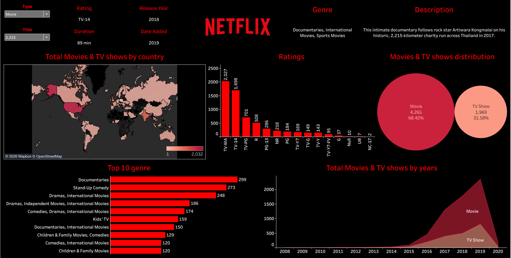

# 🎬 Netflix Movies & TV Shows Analysis — Tableau Dashboard

An interactive Tableau dashboard exploring Netflix's global content library — covering content type distribution, ratings, genres, countries, and growth trends from 2008 to 2020.



---

## 📌 Overview

Netflix's catalog spans thousands of titles across genres, countries, and content ratings. This project analyzes that catalog to answer a simple but useful question: **what does Netflix's content library actually look like, and how has it evolved?**

The dashboard lets a user filter by **Type** (Movie / TV Show) and **Title**, and instantly see:
- Full metadata for a selected title (rating, release year, duration, date added, genre, description)
- How content is distributed across the world
- The spread of content ratings (TV-MA, TV-14, R, PG, etc.)
- The Movie vs. TV Show split
- The top 10 most common genres
- How Netflix's catalog has grown year over year

---

## 🗂️ Dataset

- **Source:** Netflix Movies and TV Shows dataset (Kaggle)
- **Size:** ~6,234 titles (4,265 Movies · 1,969 TV Shows)
- **Fields used:** Type, Title, Director, Cast, Country, Date Added, Release Year, Rating, Duration, Genre (`listed_in`), Description

---

## 📊 Dashboard Breakdown

### 1. Title Details Panel
Dynamic search-and-filter panel — selecting a title from the dropdown updates the Rating, Release Year, Duration, Date Added, Genre, and Description in real time.

### 2. Total Movies & TV Shows by Country

A choropleth map showing content volume by production country. The **United States dominates** the catalog, followed by **India**, reflecting Netflix's two largest content markets in this dataset.

### 3. Ratings Distribution

`TV-MA` (2,027 titles) and `TV-14` (1,698 titles) are by far the most common ratings — together making up roughly **60% of the entire catalog** — indicating Netflix's content skews toward mature/teen audiences rather than family-friendly (G, TV-Y) content.

### 4. Movies vs. TV Shows Split

**68.4% Movies** vs. **31.6% TV Shows** — Netflix's library is still primarily film-driven, though TV Shows have been the faster-growing category in recent years (see trend chart below).

### 5. Top 10 Genres

**Documentaries** (299) and **Stand-Up Comedy** (273) lead the catalog, followed closely by international drama categories — highlighting Netflix's strong investment in documentary content and international storytelling.

### 6. Content Growth by Year

A sharp inflection point appears around **2015–2019**, where content additions grew nearly 5x — this is the period of Netflix's aggressive global content expansion, peaking around 2019 before the visible drop-off in 2020 (likely a data cutoff artifact rather than an actual decline).

---

## 🔍 Key Insights

| Insight | Detail |
|---|---|
| Content skew | Majority of content is rated for mature/teen audiences (TV-MA, TV-14) |
| Format split | Movies outweigh TV Shows nearly 2:1 |
| Top market | USA leads by a wide margin, India is a strong second |
| Genre leader | Documentaries are Netflix's single largest genre category |
| Growth story | Catalog size grew almost exponentially between 2015–2019 |

---

## 🛠️ Tools & Skills Used

- **Tableau Desktop / Public** — dashboard design, calculated fields, parameter actions, filter actions
- **Data Cleaning** — handling nulls/blanks in `country`, `rating`, and `duration` fields
- **Data Visualization Design** — dark-theme UI consistent with Netflix branding, choropleth mapping, area charts, bar charts, packed bubbles

---

## 🚀 Live Dashboard

🔗 **[View Interactive Dashboard on Tableau Public](#)** ← *replace with your Tableau Public link*

---

## 📁 Repository Structure

```
netflix-tableau-dashboard/
│
├── README.md
├── Netflix_dashboard.png          # Full dashboard screenshot
├── netflix_titles.csv             # Source dataset
├── netflix_dashboard.twbx         # Tableau packaged workbook
└── screenshots/
    ├── ratings_chart.png
    ├── genre_chart.png
    ├── bubble_chart.png
    ├── country_map.png
    └── growth_trend.png
    
```

---

## 👤 About Me

Aspiring **Data Analytics / Data Science**, currently building a portfolio of end-to-end data projects (Tableau, Power BI, Python, SQL) ahead of my job search.

- 🔗 [https://www.linkedin.com/in/arjun1425/](#)
- 📁 [https://github.com/Arjun42500](#)


---

⭐ *If you found this project useful or interesting, consider giving it a star!*

